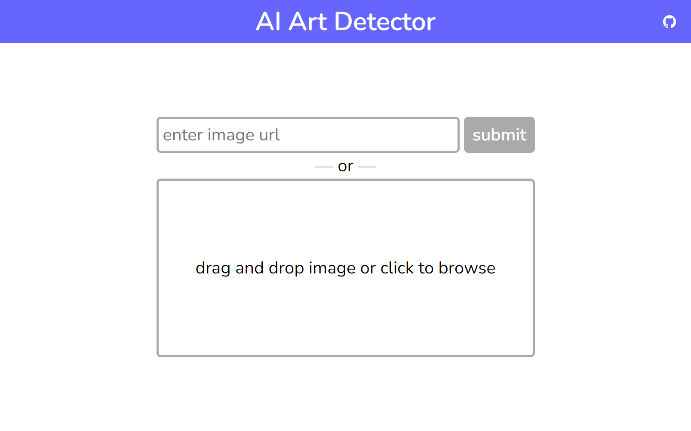
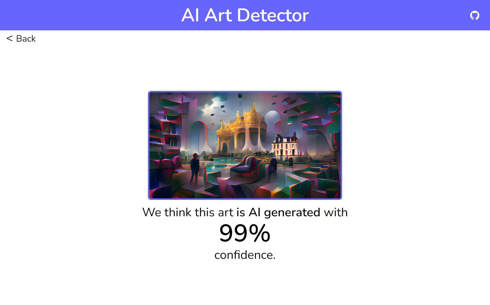
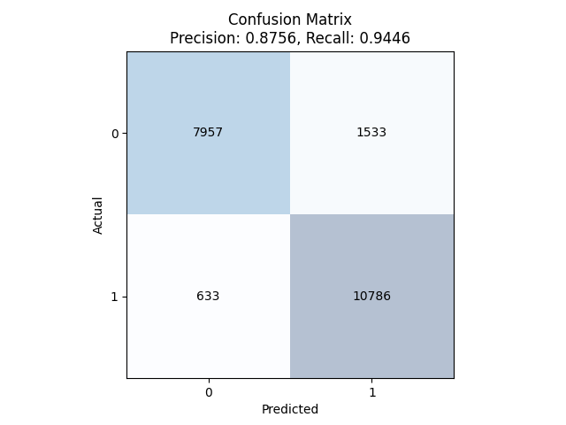
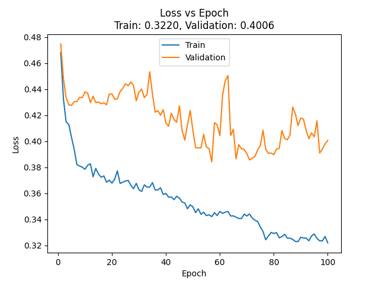

# ai-art-detector

Website that detects if artwork is AI-generated. Uses Angular, Django and PyTorch.

# About

AI Art Detector is a web app that lets users upload images and determines if they are AI-generated using machine learning.

The frontend single-page application is built using Angular. The backend is built using Django and is powered by a CNN binary image classifier built using PyTorch.





## Data

The model was trained on ~20k images from a combination of datasets:

- [laion2B-en](https://huggingface.co/datasets/laion/laion2B-en): Subset of LAION-5B, the dataset used to train the original version of the text-to-image model Stable Diffusion.

- [civitai-stable-diffusion-337k](https://huggingface.co/datasets/thefcraft/civitai-stable-diffusion-337k): Dataset of images generated by Stable Diffusion.

- [midjourney-v5-202304-clean](https://huggingface.co/datasets/wanng/midjourney-v5-202304-clean): Dataset of images generated by Midjourney.

## Results

The model performed reasonably well on the test data with a precision of 0.88 and a recall of 0.94.



However, the model struggled to generalize  during training and suffered from overfitting, most likely due to the lack of tuning and data.



Detecting AI-generated artwork using AI is probably feasible to do, but this proof-of-concept does not yet have the accuracy required to make it a real service worth using. Creating such a service would require much more technical ML knowledge and a much larger dataset.

# Setup

## Local Frontend Setup

Install the Angular CLI npm package globally:
```
npm install -g @angular/cli
```

Navigate to the source directory:
```
cd src/frontend
```

Install the required npm packages:
```
npm install
```

To start the frontend:
```
ng serve
```

The frontend should now be live at http://localhost:4200.

## Local Backend Setup

Navigate to the source directory:
```
cd src/backend/app
```

It is recommended to set up a virtual Python environment.
The following sets up and activates a virtual environment using `venv`:
```
python -m venv venv
venv/scripts/activate
```

Install the required Python packages:
```
pip install -r requirements.txt
```

Set up SQLite:
```
python manage.py makemigrations
python manage.py migrate
```

To start the backend:
```
python manage.py runserver
```

The backend should now be live at http://localhost:8000.

## Training the Model

Navigate to the source directory:
```
cd src/backend/app
```

To download the dataset:
```
python -m data.scripts.get
```
The `-fmetadata` option forces a redownload of the metadata.
The `-fdata` option forces a redownload of the data.

To preprocess the dataset:
```
python -m data.scripts.preprocess
```
The `-multiplecrop` option creates multiple crops of each image.
The `-mirror` option creates a mirror of each image.

To train a new model (this may take a while):
```
python -m data.scripts.train
```

To use the new model with the backend, update the `MODEL_VER` setting in `src/backend/app/settings.py` with the name of the new model.

## Docker Commands

Navigate to the source directory:
```
cd src/backend
```

To build the images:
```
docker-compose -f compose.dev.yaml build  # Or compose.staging.yaml, compose.prod.yaml
```

To run the containers:
```
docker-compose -f compose.dev.yaml up -d
```

To check the logs:
```
docker-compose -f compose.dev.yaml logs -f
```

To bash into a running container:
```
docker exec -it <container> bash
```

To stop the containers:
```
docker-compose -f compose.dev.yaml down
```
The `-v` option stops all volumes as well.


## AWS Commands

Navigate to the source directory:
```
cd src/backend
```

To SSH into the EC2 instance:
```
ssh -i <pem-certificate> ec2-user@<server-elastic-ip>
```

To login to the ECR repository and push the Docker images:
```
aws ecr get-login-password --region ca-central-1 | docker login --username AWS --password-stdin 310294657566.dkr.ecr.ca-central-1.amazonaws.com
docker-compose -f compose.staging.yaml push  # Or compose.prod.yaml
```
