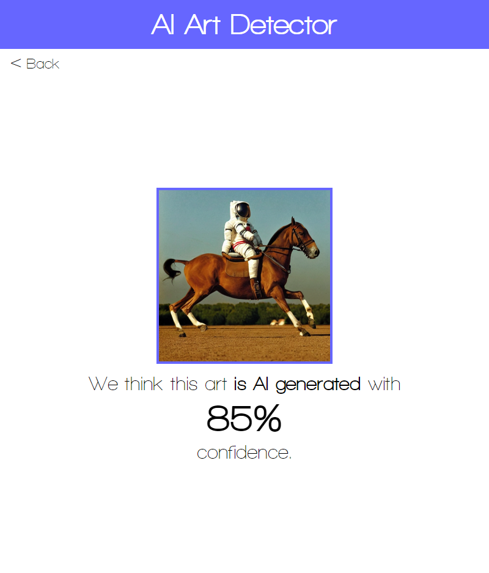
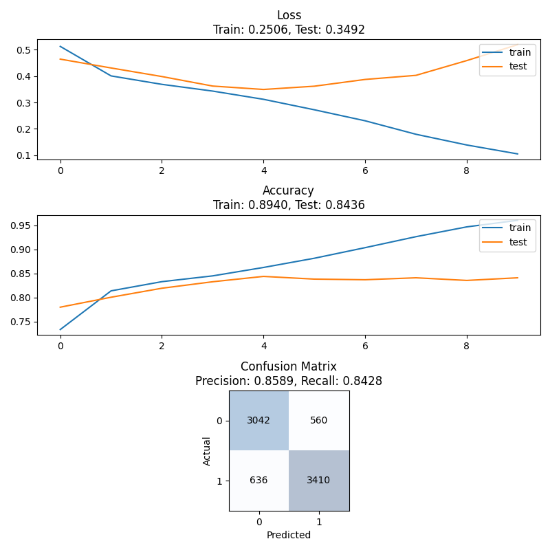

# ai-art-detector

Website that detects if artwork is AI-generated. Uses Angular, Django and Keras.

# About

AI Art Detector is a single-page web app that lets users upload images and determines if they are AI-generated using a CNN binary image classifier.

The frontend uses Angular and the backend uses Django, Keras and SQLite.




## Data

The model was trained on ~20k images from a combination of datasets:

- LAION-Aesthetics V2: A dataset of 'aesthetic' images, used by text-to-image models such as Stable Diffusion v1.

- Open Prompts: A dataset of images generated by Stable Diffusion v1.3, used by sites such as krea.ai and lexica.art.

A larger dataset could reduce overfitting and cover other popular text-to-image models such as DALL-E and Midjourney.

## Results

The model performs reasonably well with precision and recall in the mid 80s. The training suffers from overfitting, which could be reduced with a larger dataset and further tuning. Overall, the project shows that it is possible to detect AI-generated artwork using AI.



# Setup

## Frontend

Install the required npm packages:
```
npm install -g @angular/cli
```

Navigate to the frontend directory:
```
cd src/frontend
```

Start the frontend:
```
ng serve
```

The frontend should now be live at http://localhost:4200.

## Backend

Navigate to the source directory:
```
cd src/backend
```

It is recommended to set up a virtual Python environment to keep packages separate. Setup and activate a virtual environment using venv:
```
python -m venv venv
venv/scripts/activate
```

Install the required Python packages:
```
pip install -r requirements.txt
```

Set up SQLite:
```
python manage.py makemigrations
python manage.py migrate
```

Make a copy of `src/backend/example.env` and rename it to `.env`. Add a Django secret key to the file.

Start the backend:
```
python manage.py runserver
```

The backend should now be live at http://localhost:8000.

## Model

The repo includes a pretrained model so training a new model is not necessary start the project. To train a new model:

Navigate to the source directory:
```
cd src/backend
```

Download the dataset (this may take a while):
```
python -m data.get_dataset
```

Proprocess the dataset:
```
python -m data.preprocess_dataset
```

Train the model:
```
python -m data.train_model
```

To use the new model with the backend, update the `MODEL_VER` setting in `src/backend/backend/settings.py` with the name of the new model.
